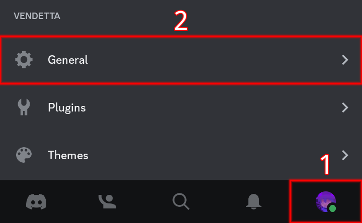
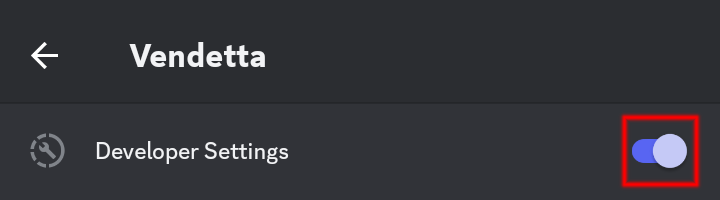
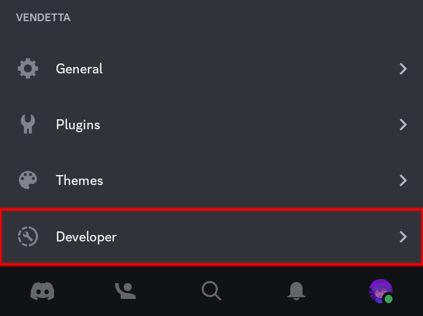
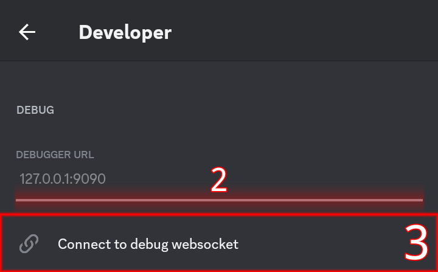

# Vendetta Debugger

A fork of @colin273/enmity-debugger, which is a (relatively) simple remote debugger for [Vendetta](https://github.com/vendetta-mod). This connects over a websocket to the Discord app with Vendetta installed and allows you to execute JavaScript in the Discord app from the command line. The REPL in this debugger is a slightly modified version of the [default REPL in Node.js](https://nodejs.org/api/repl.html), including the same commands and some support for multi-line code snippets.

## Installing

To install this debugger and its dependencies, run the following commands in the terminal:

```bash
git clone https://github.com/Meqativ/vendetta-debug && cd vendetta-debug
pnpm i
```

(The dependencies are minimal, by the way. The only third-party modules this debugger needs are `ws` for the websocket server and `ansi-colors` to make the console output look prettier. Neither of those have any dependencies of their own.)

## Running

To start the debugger, run this command from inside the `vendetta-debug` folder:

```bash
node .
```

## Connecting

0. Make sure you have the Vendetta developer options enabled.

    1. Open the you tab
    2. Locate and press the button to open the "General" page
    
    3. Locate and enable "Developer Settings"
    
1. Open the Developer page

2. Fill in your Debug URL
3. Locate and press the "Connect to debug websocket" button

4. :tada: It should connect now and show this in your console
``[Debugger] Connected to Discord over websocket, starting debug session``

### Auto-connect
You can use an option in the devkitplus ([Direct](https://vd-plugins.github.io/proxy/redstonekasi.github.io/vendetta-plugins/devkitplus/) | [Vendetta › #plugins › 💬](https://discord.com/channels/1015931589865246730/1092870826145091655)) plugin, to connect when Vendetta loads up.
0. Install the plugin
1. Open the plugin's settings
2. Enable "Auto debugger"
(You need to fill in the ["Debugger URL"](https://github.com/Meqativ/vendetta-debug/blob/master/README.md#:~:text=Fill%20in%20your%20Debug%20URL) for it to connect properly)

## Quitting

Once you have finished debugging and closed the debugger REPL, press `Ctrl+C` on your keyboard to quit the CLI.

